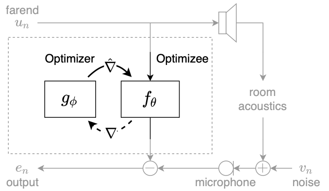

# AutoDSP
TLDR; Train custom adaptive filter optimizers without hand tuning or extra labels.





## About

Adaptive filtering algorithms are commonplace in signal processing and have wide-ranging applications from single-channel denoising to multi-channel acoustic echo cancellation and adaptive beamforming. Such algorithms typically operate via specialized online, iterative optimization methods and have achieved tremendous success, but require expert knowledge, are slow to develop, and are difficult to customize. In our work, we present a new method to automatically learn adaptive filtering update rules directly from data. To do so, we frame adaptive filtering as a differentiable operator and train a learned optimizer to output a gradient descent-based update rule from data via backpropagation through time. We demonstrate our general approach on an acoustic echo cancellation task (single-talk with noise) and show that we can learn high-performing adaptive filters for a variety of common linear and non-linear multidelayed block frequency domain filter architectures. We also find that our learned update rules exhibit fast convergence, can optimize in the presence of nonlinearities, and are robust to acoustic scene changes despite never encountering any during training.


arXiv: https://arxiv.org/abs/2110.04284

pdf: https://arxiv.org/pdf/2110.04284.pdf

Short video: https://www.youtube.com/watch?v=y51hUaw2sTg

Full video: https://www.youtube.com/watch?v=oe0owGeCsqI

## Table of contents

- [Get The Dataset](#get-the-data)
- [Configure Environment](#configure-environment)
- [Train a Model](#running-an-experiment)
- [Copyright and license](#copyright-and-license)

### Setup

#### Clone repo
```
git clone https://github.com/jmcasebeer/autodsp.git
cd autodsp
```

#### Get The Data
```
# Install Git LFS if needed
git lfs install

# Move into folder that is one above <autodsp>
cd <autodsp>/../

# Clone MS data
git clone https://github.com/microsoft/AEC-Challenge AEC-Challenge

```

#### Configure Environment
First, edit the config file to point to the dataset you downloaded.
```
vim ./autodsp/__config__.py
```

Next, setup your anaconda environment 

```
# Create a conda environment
conda create -n autodsp python=3.7

# Activate the environment
conda activate autodsp

# Install some tools
conda install -c conda-forge cudnn pip

# Install JAX
pip install --upgrade "jax[cuda111]" -f https://storage.googleapis.com/jax-releases/jax_releases.html

# Install Haiku
pip install git+https://github.com/deepmind/dm-haiku

# Install pytorch for the dataloader
conda install pytorch cpuonly -c pytorch
```
You can also check out autodsp.yaml, the export from our conda environment. We found the most common culprit for jax or CUDA errors was a CUDA/cuDNN version mismatch. You can find more details on this in the jax official repo https://github.com/google/jax. 


#### Install AutoDSP
```
cd autodsp
pip install -e ./
```
This will automatically install the dependeicies in setup.py. 


### Running an Experiment
```
# move into the experiment directory
cd experiments
```
The entry point to train and test models is `jax_run.py`. `jax_run.py` pulls configuration files from `jax_train_config.py`. The general format for launching a training run is

``` 
python jax_run.py --cfg <config_name> --GPUS <GPUS to use> 
```

where `<config_name>` is a config specified in `jax_train_config.py`, `<GPUS to use>` is something like `0 1`. You can automatically send logs to Weights and Biases by appending `--wandb`. This run will automatically generate a `/ckpts/<config_name>` directory and log checkpoints to it. You can grab a checkpoint and run it on the test set via

``` 
python jax_run.py --cfg <config_name> --GPUS <GPUS to use> --epochs <epoch checkpoints to evaluate> --eval 
```

where `<config_name>` is the same as training and `<epoch checkpoints to evaluate>` is a single epoch like `100` or a list of epochs like `100, 200, 300`. Running evaluation will also automatically dump a `.pkl` file with metrics in the same directory as the checkpoint.


An explicit example is

```
# run the training
python jax_run.py --cfg v2_filt_2048_1_hop_1024_lin_1e4_log_24h_10unroll_2deep_earlystop_echo_noise 
                --GPUS 0 1 2 3

# run evaluation on the checkpoint from epoch 100
python jax_run.py --cfg v2_filt_2048_1_hop_1024_lin_1e4_log_24h_10unroll_2deep_earlystop_echo_noise 
                --GPUS 0 --eval --epochs 100
```
You can find all the configurations from our paper in the `jax_train_config.py` file. Training can take up to a couple days depending on model size but will automatically stop when it hits the max epoch count or validation performance stops improving.


## Copyright and license
University of Illinois Open Source License

Copyright © 2021, University of Illinois at Urbana Champaign. All rights reserved.

Developed by: Jonah Casebeer 1, Nicholas J. Bryan 2 and Paris Smaragdis 1,2

1: University of Illinois at Urbana-Champaign 

2: Adobe Research 

Permission is hereby granted, free of charge, to any person obtaining a copy of this software and associated documentation files (the “Software”), to deal with the Software without restriction, including without limitation the rights to use, copy, modify, merge, publish, distribute, sublicense, and/or sell copies of the Software, and to permit persons to whom the Software is furnished to do so, subject to the following conditions: Redistributions of source code must retain the above copyright notice, this list of conditions and the following disclaimers. Redistributions in binary form must reproduce the above copyright notice, this list of conditions and the following disclaimers in the documentation and/or other materials provided with the distribution. Neither the names of Computational Audio Group, University of Illinois at Urbana-Champaign, nor the names of its contributors may be used to endorse or promote products derived from this Software without specific prior written permission. THE SOFTWARE IS PROVIDED “AS IS”, WITHOUT WARRANTY OF ANY KIND, EXPRESS OR IMPLIED, INCLUDING BUT NOT LIMITED TO THE WARRANTIES OF MERCHANTABILITY, FITNESS FOR A PARTICULAR PURPOSE AND NONINFRINGEMENT. IN NO EVENT SHALL THE CONTRIBUTORS OR COPYRIGHT HOLDERS BE LIABLE FOR ANY CLAIM, DAMAGES OR OTHER LIABILITY, WHETHER IN AN ACTION OF CONTRACT, TORT OR OTHERWISE, ARISING FROM, OUT OF OR IN CONNECTION WITH THE SOFTWARE OR THE USE OR OTHER DEALINGS WITH THE SOFTWARE.
